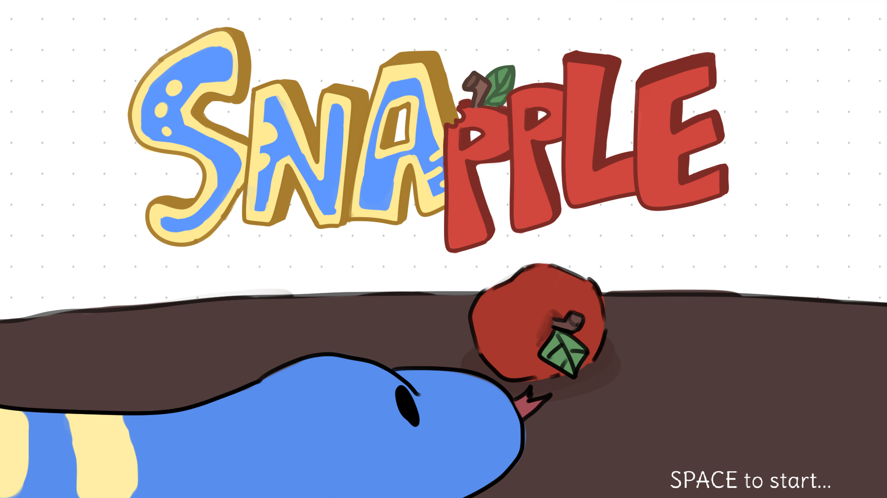
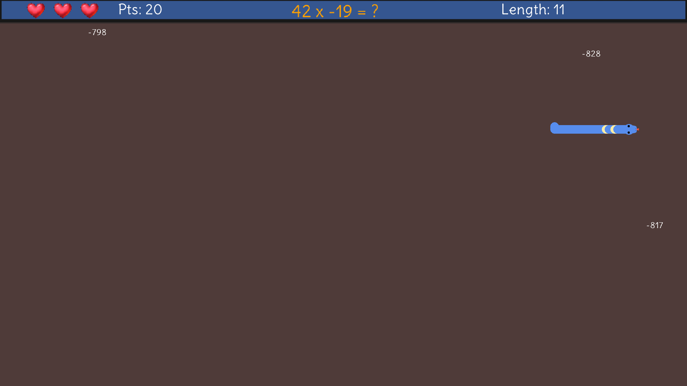

# Snapple
Snapple is a snake game to test your mental math skills. It is written in C++ with [Raylib](https://raylib.com) and [raylib-cpp](https://github.com/RobLoach/raylib-cpp) wrapper.

# Building

- Ensure that `raylib` is installed in your system's `include` directory.
- Run `git submodule init`, then `git submodule update` to pull the extra Raylib dependencies.
- Run `make`. The target file is named "snapple".

# Testing

Install `gtest` (Google Test). Then, run `make test`. The resulting executable is called `testsuite`.
